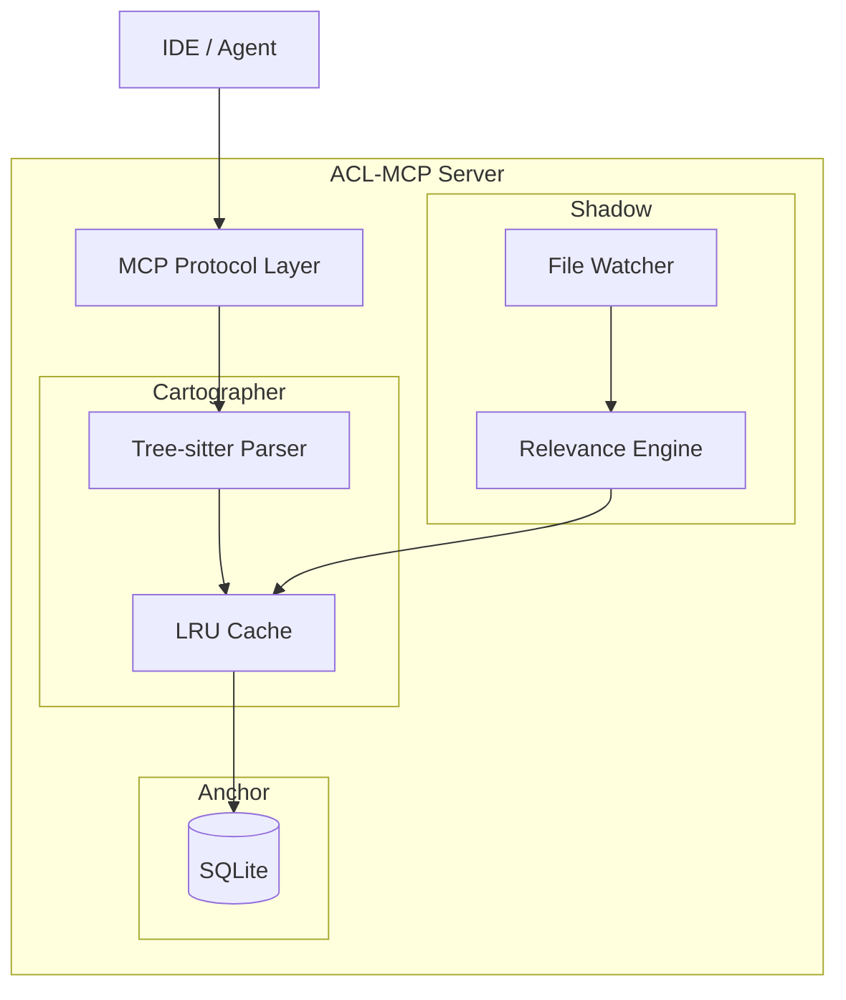

# ACL-MCP Implementation Plan

**Project:** Agent Context Lifecycle (ACL) MCP  
**Date:** December 31, 2025  
**Status:** Draft for Review  
**Prerequisites:** [Risk Mitigation Plan](file:///c:/Users/Local%20User/ACL-MCP/refs/risk-mitigation-plan.md) approved

---

## Goal

Build a local MCP server that provides persistent, structured context management for AI coding agents. The system addresses context fragmentation, reactive latency, and session discontinuity through three core pillars: Cartographer (structural mapping), Shadow (proactive awareness), and Anchor (persistence).

---

## User Review Required

> [!IMPORTANT]
> **Language Scope:** V1 targets TypeScript/JavaScript, Python, Go, and Rust. Other languages will gracefully degrade to import regex extraction. Please confirm this scope is acceptable. 

> [!WARNING]
> **MCP SDK Version:** Implementation uses `@modelcontextprotocol/sdk` v1.x. If you have a specific version requirement, please advise.

[Feedback: typescript-sdk 1.25.1 https://github.com/modelcontextprotocol/typescript-sdk (latest version)]

---

## Proposed Changes

### Project Scaffold

#### [NEW] [package.json](file:///c:/Users/Local%20User/ACL-MCP/package.json)
- Node.js project configuration
- Dependencies: `@modelcontextprotocol/sdk`, `better-sqlite3`, `tree-sitter`, `chokidar` (file watcher)
- Scripts: `dev`, `build`, `test`

#### [NEW] [tsconfig.json](file:///c:/Users/Local%20User/ACL-MCP/tsconfig.json)
- TypeScript configuration targeting ES2022, Node module resolution

#### [NEW] [.gitignore](file:///c:/Users/Local%20User/ACL-MCP/.gitignore)
- Standard Node.js ignores + SQLite database files

---

### Core Infrastructure

#### [NEW] [src/index.ts](file:///c:/Users/Local%20User/ACL-MCP/src/index.ts)
- MCP server entry point
- Registers tools: `get_context`, `refresh_context`, `get_session_state`, `save_session_state`
- Initializes Cartographer, Shadow, and Anchor modules

#### [NEW] [src/config.ts](file:///c:/Users/Local%20User/ACL-MCP/src/config.ts)
- Configuration loader (workspace path, active zones, language settings)
- Environment variable support for customization

---

### Pillar I: Cartographer (Structural Mapping)

#### [NEW] [src/cartographer/index.ts](file:///c:/Users/Local%20User/ACL-MCP/src/cartographer/index.ts)
- Main Cartographer class
- Lazy/incremental parsing strategy (per R2 mitigation)
- Cache management with hash-based invalidation (per R3 mitigation)

#### [NEW] [src/cartographer/parser.ts](file:///c:/Users/Local%20User/ACL-MCP/src/cartographer/parser.ts)
- Tree-sitter wrapper for AST extraction
- Language-specific skeleton extraction (exports, classes, functions, imports)
- Graceful fallback to regex for unsupported languages (per R4 mitigation)

#### [NEW] [src/cartographer/cache.ts](file:///c:/Users/Local%20User/ACL-MCP/src/cartographer/cache.ts)
- In-memory LRU cache for parsed skeletons
- File hash tracking for invalidation
- Debounced re-parse on file changes (500ms, per R3 mitigation)

---

### Pillar II: Shadow (Proactive Context)

#### [NEW] [src/shadow/index.ts](file:///c:/Users/Local%20User/ACL-MCP/src/shadow/index.ts)
- Main Shadow class
- Conservative V1: surfaces only direct imports/exports (per R1 mitigation)

#### [NEW] [src/shadow/watcher.ts](file:///c:/Users/Local%20User/ACL-MCP/src/shadow/watcher.ts)
- Chokidar-based file focus monitoring
- Triggers context preparation on file open/modify

#### [NEW] [src/shadow/relevance.ts](file:///c:/Users/Local%20User/ACL-MCP/src/shadow/relevance.ts)
- Simple import-graph-based relevance scoring
- Extensible interface for future heuristic improvements

---

### Pillar III: Anchor (Persistence)

#### [NEW] [src/anchor/index.ts](file:///c:/Users/Local%20User/ACL-MCP/src/anchor/index.ts)
- Main Anchor class
- Session state save/restore API

#### [NEW] [src/anchor/database.ts](file:///c:/Users/Local%20User/ACL-MCP/src/anchor/database.ts)
- SQLite schema and migrations
- Tables: `skeletons`, `sessions`, `context_artifacts`
- Synchronous operations via better-sqlite3

#### [NEW] [src/anchor/schema.sql](file:///c:/Users/Local%20User/ACL-MCP/src/anchor/schema.sql)
- Initial database schema definition

---

### MCP Tool Definitions

| Tool | Description |
|------|-------------|
| `acl_get_context` | Returns structural skeleton for a file or directory |
| `acl_get_related` | Returns related files based on import graph |
| `acl_refresh` | Force re-parse of specified files |
| `acl_save_session` | Persist current context state to Anchor |
| `acl_restore_session` | Restore context state from previous session |

---

## Architecture Diagram



---

## Verification Plan

### Automated Tests

Since this is a new project, tests will be created alongside implementation.

#### Unit Tests (Vitest)
```bash
npm run test
```

| Test File | Coverage |
|-----------|----------|
| `tests/cartographer/parser.test.ts` | Tree-sitter parsing per language |
| `tests/cartographer/cache.test.ts` | Cache invalidation, LRU eviction |
| `tests/shadow/relevance.test.ts` | Import graph traversal |
| `tests/anchor/database.test.ts` | SQLite CRUD operations |

#### Integration Test
```bash
npm run test:integration
```
- Spins up MCP server
- Makes tool calls via MCP SDK client
- Verifies end-to-end context retrieval

### Manual Verification

1. **Build & Run:**
   ```bash
   cd c:\Users\Local User\ACL-MCP
   npm install
   npm run build
   npm run dev
   ```

2. **Test with MCP Inspector (if available):**
   - Connect to `localhost:3000` (or configured port)
   - Call `acl_get_context` with a real TypeScript file
   - Verify skeleton output contains expected exports/functions

3. **Integration with Antigravity:**
   - Add ACL-MCP to Antigravity's MCP server list
   - Open a project file and verify agent can use `acl_get_context`

---

## Implementation Phases

| Phase | Scope | Estimated Effort |
|-------|-------|------------------|
| **Phase 1** | Project scaffold + Anchor (SQLite setup) | 1 day |
| **Phase 2** | Cartographer (parsing + cache) | 2-3 days |
| **Phase 3** | Shadow (watcher + basic relevance) | 1-2 days |
| **Phase 4** | MCP tool registration + integration | 1 day |
| **Phase 5** | Testing + polish | 1-2 days |

**Total estimated effort:** 6-9 days

---

## Revision History

| Date | Author | Notes |
|------|--------|-------|
| 2025-12-31 | Gemini | Initial draft |
